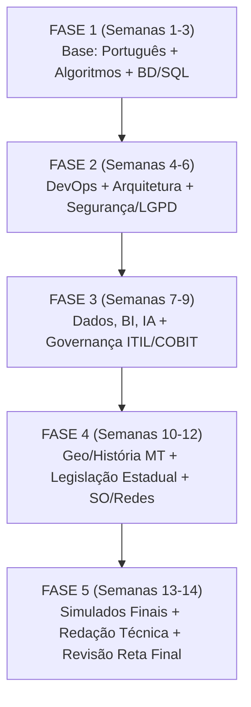

---
tags:
  - fluxo
  - estrategia
  - planejamento
---
# 📋 Fluxo de Estudo — Plano Estruturado em 5 Fases

## 🗺️ Diagrama de Fluxo Geral



---

## 🎯 Detalhamento das 5 Fases

### FASE 1: Fundamentos Nucleares (Semanas 1 a 3)
* **Objetivo:** Garantir pontuação garantida nos conteúdos mais matemáticos e lógicos da prova objetiva.
* **Disciplinas-Chave:**
  - [[03 - Língua Portuguesa]]: Foco em crase, regência, concordância e reescrita de frases.
  - [[13 - Estrutura de Dados e Algoritmos]]: Listas, pilhas, filas, árvores binárias, complexidade de algoritmos O(n).
  - [[16 - Banco de Dados e SQL]]: Álgebra relacional, normalização (1FN, 2FN, 3FN), comandos DDL/DML e propriedades ACID.
* **Carga Horária:** 20h a 25h semanais.
* **Meta de Validação:** > 75% de acertos em listas de exercícios de SQL e Algoritmos da Cesgranrio.

### FASE 2: Engenharia de Software & Segurança (Semanas 4 a 6)
* **Objetivo:** Dominar os pilares de desenvolvimento moderno e proteção de dados que frequentemente geram questões discursivas.
* **Disciplinas-Chave:**
  - [[06 - Segurança da Informação e Privacidade]]: Criptografia, PKI, Zero Trust, Firewalls/WAF e LGPD.
  - [[07 - Desenvolvimento de Software e DevOps]]: CI/CD, Git, Docker, Kubernetes, Scrum e XP.
  - [[08 - Arquitetura de Software e APIs]]: Microsserviços vs. Monólito, REST/SOAP, Design Patterns (GoF).
* **Carga Horária:** 25h semanais + início do treino discursivo (1 texto a cada 10 dias).

### FASE 3: Dados, Inteligência Artificial & Governança (Semanas 7 a 9)
* **Objetivo:** Cobrir as inovações tecnológicas do edital que a Cesgranrio tem cobrado intensamente nos últimos concursos (BNDES, Banco do Brasil e Caixa).
* **Disciplinas-Chave:**
  - [[09 - Inteligência Artificial e Ciência de Dados]]: Machine Learning supervisionado/não-supervisionado, NLP, Redes Neurais.
  - [[10 - Big Data e Business Intelligence]]: Modelagem dimensional (Star/Snowflake), Hadoop, NoSQL.
  - [[11 - Tecnologias Emergentes (IoT e Blockchain)]]: Edge Computing, consenso blockchain.
  - [[12 - Governança e Gestão de TI (ITIL e COBIT)]]: ITIL 4 (Incidentes, Problemas, Mudanças) e COBIT 2019.
* **Carga Horária:** 25h semanais.

### FASE 4: Regional, Legislação & Infraestrutura (Semanas 10 a 12)
* **Objetivo:** Blindar os 15 pontos de Conhecimentos Gerais para **garantir não zerar nenhuma matéria** e somar pontos preciosos.
* **Disciplinas-Chave:**
  - [[04 - Geografia e História de MT]]: Geografia física, agronegócio, Cuiabá colonial, Rusga e desmembramento.
  - [[05 - Ética, Filosofia, Atualidades e Legislação]]: LC 04/1990 (Estatuto MT), LC 112/2002 (Ética MT).
  - [[14 - Sistemas Operacionais e Redes]]: Linux básico, Active Directory, DNS, DHCP.
  - [[15 - Linguagens de Programação (Python e Java)]]: POO e sintaxe.
* **Carga Horária:** 20h a 25h semanais.

### FASE 5: Reta Final, Simulados e Discursivas (Semanas 13 e 14)
* **Objetivo:** Gestão de tempo de prova (5 horas para 70 questões + 1 redação técnica).
* **Atividades:**
  - Realizar 2 simulados completos de 5 horas com cartão de resposta e folha de redação.
  - Revisão acelerada por flashcards e mapas mentais das normas e leis.
  - Treino de caligrafia e organização de tópicos para a Prova Discursiva.

---

## ⚖️ Distribuição de Carga Horária por Peso na Prova

```
Conhecimentos Específicos de TI (40 pts | 57%) ──████████████████ (55% do tempo)
Língua Portuguesa (15 pts | 21%)                ──██████ (18% do tempo)
Geografia e História de MT (10 pts | 14%)       ──████ (15% do tempo)
Ética, Filosofia e Legislação (5 pts | 7%)      ──██ (12% do tempo)
Discursiva (10 pts adicionais)                  ── Treino contínuo semanal
```

---

## 📅 Ciclo Semanal Sugerido (Exemplo 20h/semana)

| Dia | Bloco 1 (1h30) | Bloco 2 (1h30) | Fechamento (30min) |
| :--- | :--- | :--- | :--- |
| **Segunda** | Conhecimentos Específicos: Banco de Dados / SQL | Língua Portuguesa | Resolução de 15 questões |
| **Terça** | Conhecimentos Específicos: Engenharia de Software / DevOps | Geografia de Mato Grosso | Flashcards / Anki |
| **Quarta** | Conhecimentos Específicos: Segurança da Informação & LGPD | História de Mato Grosso | Resolução de 15 questões |
| **Quinta** | Conhecimentos Específicos: Governança (ITIL / COBIT) | Ética & Legislação MT (LC 04 e LC 112) | Leitura de Lei Seca |
| **Sexta** | Conhecimentos Específicos: IA, Big Data ou Algoritmos | Língua Portuguesa | Resolução de 20 questões |
| **Sábado** | **Produção de Prova Discursiva de TI (Tema Técnico)** | Revisão dos erros da semana | Leitura de resumos |
| **Domingo** | Descanso / Simulado Parcial ou Leitura Leve | - | Planejamento da semana |
